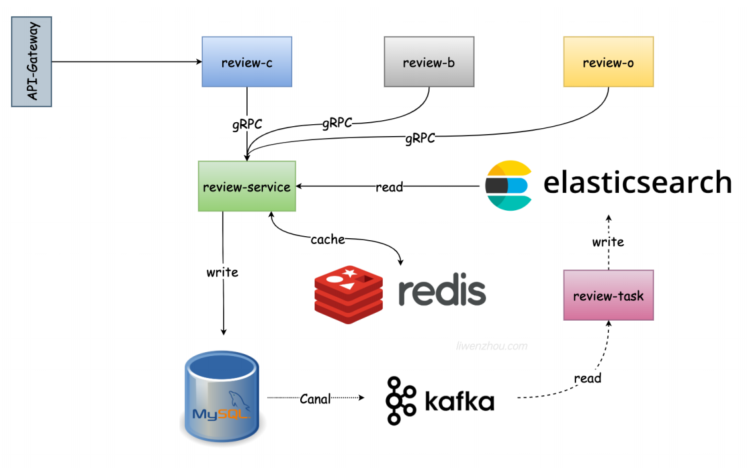

# 基于Kratos实现一个评价的服务模块
其基本的结构体如图所示
 

## 基本事项
1. 所有的订单状态的逻辑应该放在上面的c、b、o端去操作，这里只会提供GRPC的服务，不会提供HTTP的服务。

## 实现步骤

### 创建架构阶段
1. 创建项目
```bash
kratos new review-service
```
2. 添加自定义的proto文件
```bash
kratos proto add api/review/v1/review.proto
```
然后根据自己的业务逻辑去修改代码
3. 生成客户端的代码
```bash
kratos proto client api/review/v1/review.proto
```
4. 生成服务端的代码
```bash
kratos proto server api/review/v1/review.proto -t internal/service
```
5. 开发代码
在internal下进行开发，顺着请求的流程开始写```service->biz->data```

### 项目依赖准备
1. 准备mysql、redis环境
```bash
docker run --name mysql-server -p 3306:3306 -e MYSQL_ROOT_PASSWORD=root -d mysql
docker run --name redis-server -p 6379:6379 -d redis:5.0.7
```

2. 建立数据表
2.1 创建review.sql文件
2.2 在数据库中创建表

3. 修改配置文件conf.yaml，并且去查看conf.proto文件是否对应上，然后生成config的代码
```bash
make config
```

### 通过GORM Gen框架生成数据库操作代码
1. 安装依赖
```bash
go get -u gorm.io/gen
```
2. 定义Gen配置
2.1. 在cmd层下创建gen文件夹，然后创建generate.go文件，然后根据https://liwenzhou.com/posts/go/gen/的模板去写。

2.2. 修改以下的地方：1. 从配置文件去读取数据库的地址，参考main函数的写法；2. 修改输出的相对路径

3. 生成代码
切换到该代码目录下运行
```bash
go run .
```

### 实现一个创建评价的接口
#### 1. 修改api文件
按照需要修改proto文件
#### 2. 生成客户端和服务端的代码
```bash
kratos proto client api/review/v1/review.proto
kratos proto server api/review/v1/review.proto -t internal/service
```
#### 3. 填充业务逻辑
在internal目录下：server --> service --> biz --> data
1. 修改server层下grpc和http的相关参数，因为模板生成的时候都是用的helloword。以及包中import的v1的路径

2. 参考greeter.go去修改review.go代码，包含：1.嵌入uc结构体。

3. 参考biz层的greeter.go的代码自己去实现一个review.go代码
这里的model就可以直接利用gen生成的model代码了，不需要自己像greeter.go一样创建一个跟表一样的结构了。注意的是这里生成的model并非DTO，而是和数据库交流的DAO

4. 修改data层代码
4.1 修改data.go代码：以往需要去自己实现一个db，因为用gen框架生成了数据结构，因此只需要传入query.Query即可拿到数据实体
4.2 自定义实现一个reviewer.go的数据库实现
4.3 并不一定要自己去实现NewDB，为了程序的扁平化，分开会比较好一点

5. 更新ProviderSet执行Wire实现依赖注入
默认的还是greeter相关的，需要换成review相关的。还是按照上面的server --> service --> biz --> data层级关系去修改

#### 4. 使用Validator中间件对参数进行校验
1. 在api下的proto文件加入Validator的相关规则，具体可以参数kratos的官方文档https://go-kratos.dev/zh-cn/docs/component/middleware/validate/

2. 在MAKEFILE下接入
```bash
.PHONY: validate
# generate validate proto
validate:
    protoc --proto_path=. \
           --proto_path=./third_party \
           --go_out=paths=source_relative:. \
           --validate_out=paths=source_relative,lang=go:. \
           $(API_PROTO_FILES)

make validate
```

3. 在server层下的http和GRPC都引入中间件
```go
// HTTP
httpSrv := http.NewServer(
    http.Address(":8000"),
    http.Middleware(
        validate.Validator(),
    ))
//GRPC
grpcSrv := grpc.NewServer(
    grpc.Address(":9000"),
    grpc.Middleware(
        validate.Validator(),
    ))

```

#### 5. 接入错误处理，返回清晰的响应
1. 在api层下定义一个自己的err.proto文件，然后编写自定义的状态码

2. 通过命令去生成代码，在MAKEFILE加入代码
```MAKEFILE
protoc --proto_path=. \
         --proto_path=./third_party \
         --go_out=paths=source_relative:. \
         --go-errors_out=paths=source_relative:. \
         $(API_PROTO_FILES)

// 执行
make errors
```

3. 在需要错误返回的地方，调用创建的错误代码

### 实现一个商家回复评论的接口
#### 1. 按照上面接口的步骤去修改各个文件的代码
#### 2. 这里涉及到一个水平越权的校验和事务的操作方式

### 代码管理方式---multi-repo+submodule
#### 1. 管理pb文件
 - proto文件要用一个
 - protoc要使用同一个版本
通常在公司中都是把protoc文件和生成的不同语言的代码都放在单独的代码库中。别的项目直接引用这个公用代码库。不同的protoc编译器会冲突。

如review-b --> RPC -->review-service。

通过git submodule方法，也就是说通过git仓库拉取公用的api文件
 

