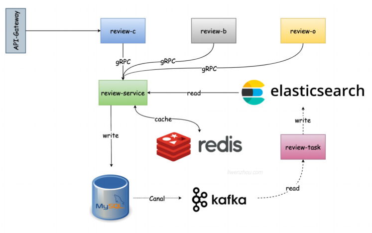

# 基于Kratos实现一个评价的服务模块
其基本的结构体如图所示
 

## 基本事项
1. 所有的订单状态的逻辑应该放在上面的c、b、o端去操作，这里只会提供GRPC的服务，不会提供HTTP的服务。

## 实现步骤

### 创建架构阶段
1. 创建项目
```bash
kratos new review-service
```
2. 添加自定义的proto文件
```bash
kratos proto add api/review/v1/review.proto
```
然后根据自己的业务逻辑去修改代码
3. 生成客户端的代码
```bash
kratos proto client api/review/v1/review.proto
```
4. 生成服务端的代码
```bash
kratos proto server api/review/v1/review.proto -t internal/service
```
5. 开发代码
在internal下进行开发，顺着请求的流程开始写```service->biz->data```

### 项目依赖准备
1. 准备mysql、redis环境
```bash
docker run --name mysql-server -p 3306:3306 -e MYSQL_ROOT_PASSWORD=root -d mysql
docker run --name redis-server -p 6379:6379 -d redis:5.0.7
```

2. 建立数据表
2.1 创建review.sql文件
2.2 在数据库中创建表

3. 修改配置文件conf.yaml，并且去查看conf.proto文件是否对应上，然后生成config的代码
```bash
make config
```

### 通过GORM Gen框架生成数据库操作代码
1. 安装依赖
```bash
go get -u gorm.io/gen
```
2. 定义Gen配置
2.1. 在cmd层下创建gen文件夹，然后创建generate.go文件，然后根据https://liwenzhou.com/posts/go/gen/的模板去写。

2.2. 修改以下的地方：1. 从配置文件去读取数据库的地址，参考main函数的写法；2. 修改输出的相对路径

3. 生成代码
切换到该代码目录下运行
```bash
go run .
```

### 实现一个创建评价的接口
#### 1. 修改api文件
按照需要修改proto文件
#### 2. 生成客户端和服务端的代码
```bash
kratos proto client api/review/v1/review.proto
kratos proto server api/review/v1/review.proto -t internal/service
```
#### 3. 填充业务逻辑
在internal目录下：server --> service --> biz --> data
1. 修改server层下grpc和http的相关参数，因为模板生成的时候都是用的helloword。以及包中import的v1的路径

2. 参考greeter.go去修改review.go代码，包含：1.嵌入uc结构体。

3. 参考biz层的greeter.go的代码自己去实现一个review.go代码
这里的model就可以直接利用gen生成的model代码了，不需要自己像greeter.go一样创建一个跟表一样的结构了。注意的是这里生成的model并非DTO，而是和数据库交流的DAO

4. 修改data层代码
4.1 修改data.go代码：以往需要去自己实现一个db，因为用gen框架生成了数据结构，因此只需要传入query.Query即可拿到数据实体
4.2 自定义实现一个reviewer.go的数据库实现
4.3 并不一定要自己去实现NewDB，为了程序的扁平化，分开会比较好一点

5. 更新ProviderSet执行Wire实现依赖注入
默认的还是greeter相关的，需要换成review相关的。还是按照上面的server --> service --> biz --> data层级关系去修改

#### 4. 使用Validator中间件对参数进行校验
1. 在api下的proto文件加入Validator的相关规则，具体可以参数kratos的官方文档https://go-kratos.dev/zh-cn/docs/component/middleware/validate/

2. 在MAKEFILE下接入
```bash
.PHONY: validate
# generate validate proto
validate:
    protoc --proto_path=. \
           --proto_path=./third_party \
           --go_out=paths=source_relative:. \
           --validate_out=paths=source_relative,lang=go:. \
           $(API_PROTO_FILES)

make validate
```

3. 在server层下的http和GRPC都引入中间件
```go
// HTTP
httpSrv := http.NewServer(
    http.Address(":8000"),
    http.Middleware(
        validate.Validator(),
    ))
//GRPC
grpcSrv := grpc.NewServer(
    grpc.Address(":9000"),
    grpc.Middleware(
        validate.Validator(),
    ))

```

#### 5. 接入错误处理，返回清晰的响应
1. 在api层下定义一个自己的err.proto文件，然后编写自定义的状态码

2. 通过命令去生成代码，在MAKEFILE加入代码
```MAKEFILE
protoc --proto_path=. \
         --proto_path=./third_party \
         --go_out=paths=source_relative:. \
         --go-errors_out=paths=source_relative:. \
         $(API_PROTO_FILES)

// 执行
make errors
```

3. 在需要错误返回的地方，调用创建的错误代码

### 实现一个商家回复评论的接口
#### 1. 按照上面接口的步骤去修改各个文件的代码
#### 2. 这里涉及到一个水平越权的校验和事务的操作方式

### 代码管理方式---multi-repo+submodule
#### 1. 管理pb文件
 - proto文件要用一个
 - protoc要使用同一个版本
通常在公司中都是把protoc文件和生成的不同语言的代码都放在单独的代码库中。别的项目直接引用这个公用代码库。不同的protoc编译器会冲突。

如review-b --> RPC -->review-service。

通过git submodule方法，也就是说通过git仓库拉取公用的api文件

### 服务注册
#### 新增注册中心的配置---consul
1. 服务中心的dokcer参考```http://127.0.0.1:8500/ui/dc1/services```
2. 新增consul的conf和yaml
2.1 可以新增一个.yaml文件
2.2 然后在main函数里面加入
```go 
// 对应的是registry.yaml的配置
	var rc conf.Registry
	if err := c.Scan(&rc); err != nil {
		panic(err)
	}
```
3. 因为我们在main函数的newapp引入了```r registry.Registrar```，因此需要在别的地方提前把这个包进来，我们考虑在server层下面定义这个，然后包进来

4. 在wire.go函数里面把```*conf.Registry```也包进来

5. 然后在newapp的函数里面注册```kratos.Registrar(r)```

#### 实现商家申述的接口
1. 前面都是按常规的逻辑进行
2. 因为区分了不同的proto，需要在server端的grpc和http中继续注册服务
2. 这里最重要的就是实现创建商家申述的接口
```go
func (b *businessRepo) CreateAppealReview(ctx context.Context, appealReview *model.ReviewAppealInfo) error {
	return b.data.query.ReviewAppealInfo.WithContext(ctx).Clauses(clause.OnConflict{
		Columns: []clause.Column{{Name: "review_id"}},
		// 只有当 review_id 冲突时，才执行以下更新
		DoUpdates: clause.Assignments(map[string]interface{}{
			"status":     appealReview.Status,
			"content":    appealReview.Content,
			"reason":     appealReview.Reason,
			"pic_info":   appealReview.PicInfo,
			"video_info": appealReview.VideoInfo,
		}),
	}).Create(appealReview)
}
```
这里是冲突才更新，不冲突就直接插入，注意的是这里的```{Name: "review_id"}```必须是唯一索引

#### 实现审核端审核申述的接口
##### 1. 重点：这里的事务操作是通过在biz层定义的：
1.1 首先构造一个事务的接口放在biz.go，这样就可以实现全不biz层通用，然后在```OperationUsecase```中嵌入这个接口
1.2 然后在data层需要实现一个从context中取出tx对象的函数，以便在调用事务操作的时候可以取出所需要的query.Query。同时其他的函数实现也需要通过这个函数拿出query.Query对象。
1.3 之所以定义一个空结构体，是为了可以在取出的时候有一个独一无二的key，之所以用结构体是因为：
1.3.1 如果用字符串做 Key。假设你用 "tx"，巧了，另一个你引入的插件也用 "tx"。当你试图从 ctx 里取事务对象时，可能会取到那个插件存进去的一个字符串或结构体，导致程序运行时崩溃（Panic）。
1.3.2 在 Go 中，两个接口值相等的前提是：类型相同且值相同。当你定义了 type ctxTransactionKey struct{}，这个类型是你包内私有的。即便别的包也定义了一个一模一样的 type ctxTransactionKey struct{}，在 Go 看来，它们也是完全不同的两个类型。
1.3.3 空结构体零开销
1.4 在data层要实现创建这个接口的函数，用来向上注册
***重点***：这个事务的实现可以全函数通用，可以在bussiness\data\operation都可以用

#### Canal工具的引入
简介可以看```https://liwenzhou.com/posts/go/canal/```
如果canal一直连不上的话，可以把```canal.instance.master.address=host.docker.internal:3306```更改为```canal.instance.master.address=172.23.80.1:3306```

#### kafka工具的引入
具体的内容同样参考李文州的博客```https://liwenzhou.com/posts/go/kafka-go/```，粗略的介绍可以看网盘项目的PDF

#### Elasticsearch工具的引入
具体内容可以参考```https://liwenzhou.com/posts/go/elasticsearch/```
##### 实现一个从elasticsearch查询评价的接口
###### 1. 对于从ela查询的方式中，通过Bool.Filter不会去计算文档的相关度，只会去确认是否是这个值；同时Filter会自动缓存查询结果
###### 2. 时间格式的反序列化，因为ela的时间格式是2006-01-02 15:04:05，而反序列化是2026-05-06T13:49:28Z，不匹配，容易冲突，可以通过自定义结构体去解决。关于为什么要在biz层定义，是因为data层引用了data，防止循环引用

#### Redis的引入
一般都是先查redis，再去查elasticsearch。这也是对ela的一个保护。加入singeflight可以防止缓存击穿。将大量的请求合成一个请求
1. 关于这部分的json的序列化和反序列化：
1.1 序列化的输出就是[]byte的形式，反序列化的输入也的是[]byte，字节切片就是所有的信息都用数字来表示，例如["a"]---->[24]。
1.2 序列化就是例如
```type msg struct{
    string s `json:a`
}
```
变化为```["a" : "内容"]
1.3 而反序列化就是根据结构体的tag(```a```)去匹配结构体字段的内容(```s```)

#### openapi工具 ----这里可以快速生成api的在线文档
可以根据proto的结构，自动生成
```bash
go install github.com/google/gnostic/cmd/protoc-gen-openapi@latest

make api

```